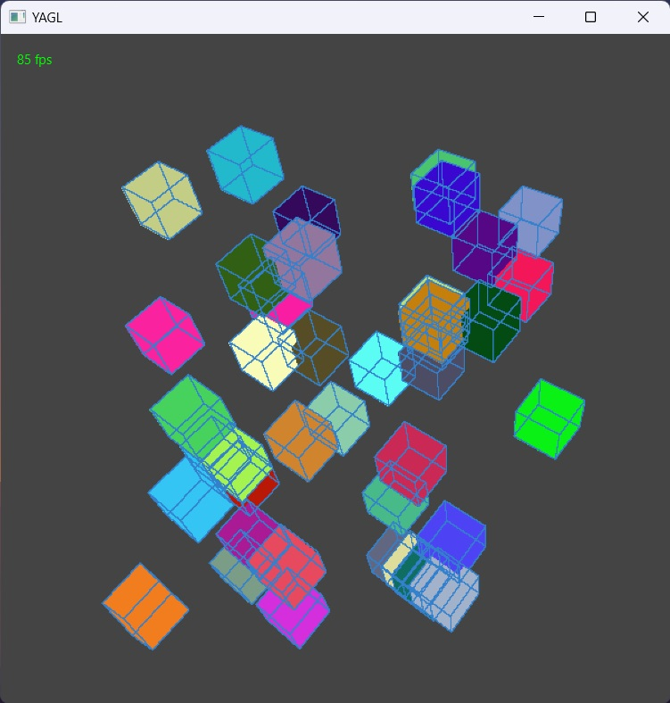

# YAGL - Yet Another Graphics Library

## Description
This is simple 3d **CPU based** graphics renderer which allows to render simple geometry and also supports rendering .obj files.
This project was made for university course.

## Features
- Rendering of simple geometry (triangles, quads, cubes etc.)
- Rendering of .obj files
- simple animation (moving, rotating objects)

# Drawing steps (Drawer.java)
1. 

